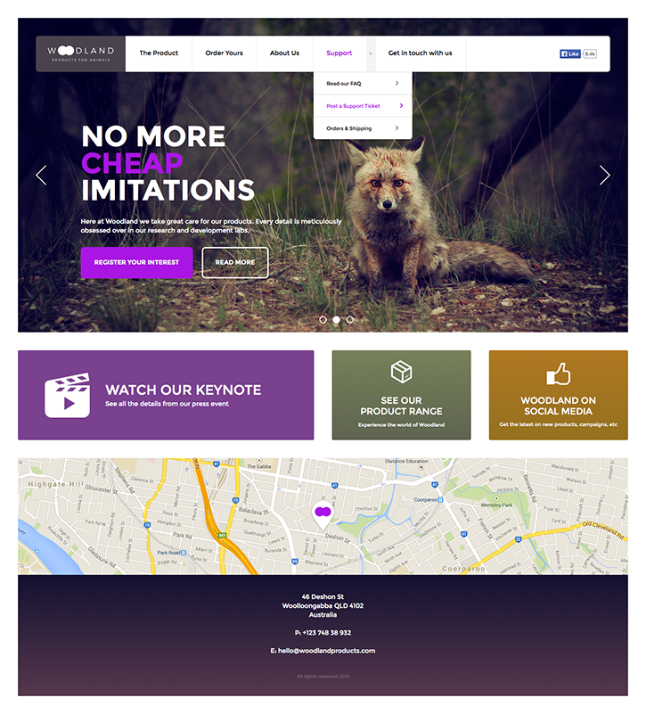

# Front-end Sampler
## Project brief

Convert the following Woodland web site to HTML/CSS/JS.

## Requirements

###Needed files:
* Slick for frontpage slider - http://kenwheeler.github.io/slick/
* Datepicker Flatpickr’ga https://github.com/chmln/flatpickr
* Google Maps API - https://developers.google.com/maps/documentation/javascript/tutorial
* Fonts - https://www.google.com/fonts or using @font-face directly

###Specifications:
* Width: 100%, 40px padding/margin.
* Responsive design (Mobile customization starts at 1024px ends at 320px width)

##Step 1

Create basic layout using header, footer, main etc. Add needed fonts, meta tags, files etc. Scripts must be added to body end.

##Step 2

Style header elements

* Whole header logo area including background should be clickable (links to index.html).
* Header menu dropdown should be visible only on hover, but on click in mobile.

##Step 3

Create slider gallery

* Create slider using Flexslider script. Don't use flexslider default CSS. Create our own theme.

##Step 4

Link blocks

* Use CSS3 gradients where needed.

##Step 5

Style footer elements

* Create footer map using Google Maps API V3. Location is not important.
* Footer background should be CSS3 gradient.
* Footer e-mail should be link that opens user's default e-mail client.

##Step 6

Dialog

* Dialog should fade in by clicking "REGISTER YOUR INTEREST" button.
* Make sure to use only needed scripts (datepicker, autocomplete) in the form.
  - Select & file input - make them work with minimal jQuery or JS.
  - Radio & Checkbox - CSS only.
  - Datepicker & Autocomplete - Don't use default CSS. Create our own theme.
* Don't use class to style table odd rows. Use CSS selector.
* Make the dialog fade out by clicking "CANCEL" button.

##Step 7

Responsive customizations

* Mobile menu (Use existing menu - just modify the styles) should slide in from the right side. Create a button with hamburger (menu) icon to toggle the menu. Hamburger icon should be made with CSS pseudo-element using background-color and box-shadow. Menu links should be under each other. Menu has fixed position.
* Create a CSS transition that smooths the menu toggling.
* Make the whole page slide left when menu is open. Smooth with CSS transition.
* Make sure everything looks good and there is no overflow and no horizontal scrollbar.

##Step 8

* Create a file called test.html
* jQuery test
  - Create a datepicker (using jQueryUI datepicker) that has "disabled" class on certain dates. (10.05.2015, 12.05.2015 & 18.05.2015)
* CSS test
  - Create 8 anchor blocks (link them to: http://www.we.ee/, dimensions: 150x20px, margin: 0 0 10px 10px; background:#000;). Use CSS to display the link URL inside the block. Float them left and use clear:left; on every third block. The last two elements must have a red background-color and no text inside them. Make the second block blink a green background color and rotate.

## Download PSD or Sketch

[Sketch.zip](Sketch.zip?raw=true) (24.2 MB)

[PSD.zip](PSD.zip?raw=true) (8.6 MB)

## Standards

When working on the project follow our coding requirements:
- [Standards and requirements](https://github.com/AlarWE/Front-end-sampler/blob/master/Standards_and_requirements.md)

## Supported browsers

Ensure that the elements work and display correctly in the following browsers:

- Firefox (latest version)
- Google Chrome (latest version)
- Internet Explorer 11
- Safari (latest version)

## Project Delivery
Create a public repo on your Github account and share the project URL with us once it’s done.
